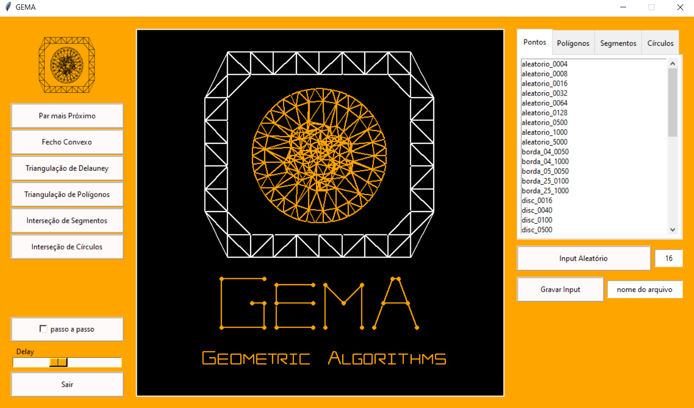

## Gema - *Geometric Algorithms*

Plataforma feita em Python com Tkinter para representação visual de vários algoritmos geométricos.

</img>

Feita inspirado no curso MAC0331 - Geometria computacional (IME-USP).

Vários elementos dessa plataforma foram herdados da [plataforma original](https://gitlab.com/visportella/geocomp-py-framework) que usamos no curso, as diferenças dessa plataforma para o *Gema* estão na organização do código do front-end, na exibição dos arquivos e nos inputs aleatórios, além de outras mini mudanças em algumas classes. Os algoritmos de uma plataforma devem funcionar na outra fazendo poucas adequações.

### Adicionando um novo problema

- Crie um novo diretório em `algoritmos/` para o seu problema
-  Altere o vetor `problemas` do arquivo `itens.py` conforme explicado no arquivo

### Adicionando um novo algoritmo à um problema

- Crie um novo arquivo `.py` no diretório do problema com seu algoritmo
- Adicione seu algoritmo no vetor `algoritmos` do arquivo `itens.py` conforme explicado no arquivo

Para adicionar novo input, basta criar um arquivo no diretório `input` com as coordenadas dos pontos, ou gravar um input aleatório gerado na própria interface.

Para não visualizar o logo na inicialização, rodar com o argumento --no-logo
